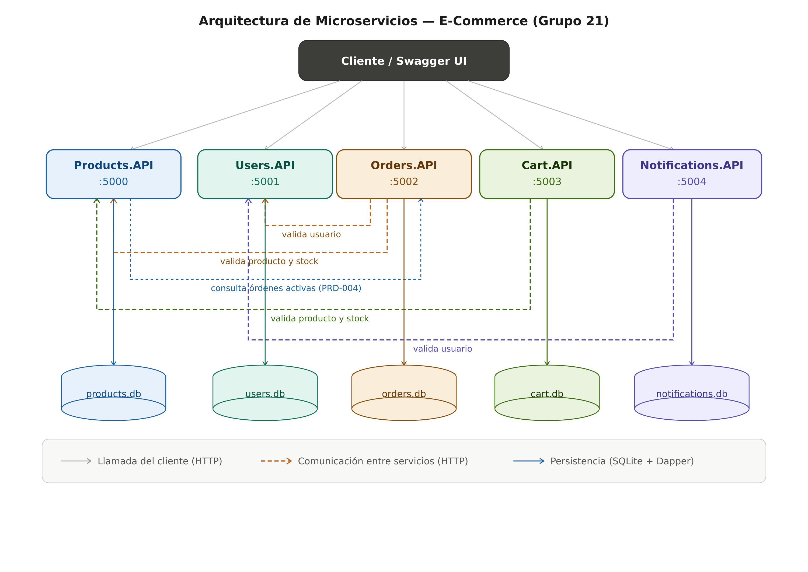

# E-Commerce — Arquitectura de Microservicios

Trabajo Práctico de **Construcción de Aplicaciones Informáticas** — Grupo 21.

Sistema de e-commerce basado en una arquitectura de microservicios. Cada funcionalidad se expone como una REST API independiente en **C# con .NET 8**, con persistencia en **SQLite + Dapper**, documentación con **Swagger**, logging estructurado con **Serilog**, **Health Checks** y propagación de **Correlation ID**.

---

## Arquitectura



El sistema está compuesto por cinco microservicios. Cada uno tiene su propia base de datos SQLite y se comunica con los demás vía HTTP usando `IHttpClientFactory`.

| Microservicio | Puerto | Responsabilidad | Se comunica con |
|---|---|---|---|
| Products.API | 5000 | Catálogo de productos | Orders (para PRD-004) |
| Users.API | 5001 | Registro y autenticación | — |
| Orders.API | 5002 | Creación y seguimiento de órdenes | Users, Products |
| Cart.API | 5003 | Carrito de compras | Products |
| Notifications.API | 5004 | Registro de notificaciones | Users |

---

## Requisitos previos

- [.NET 8 SDK](https://dotnet.microsoft.com/download/dotnet/8.0)
- Visual Studio Code con la extensión **C# Dev Kit** (o Visual Studio)

Verificar la instalación:

```bash
dotnet --version
```

---

## Cómo ejecutar

Cada microservicio se levanta en su propia terminal. Desde la raíz de la solución:

```bash
# Terminal 1
cd src/Products.API && dotnet run

# Terminal 2
cd src/Users.API && dotnet run

# Terminal 3
cd src/Orders.API && dotnet run

# Terminal 4
cd src/Cart.API && dotnet run

# Terminal 5
cd src/Notifications.API && dotnet run
```

Al iniciar, cada servicio crea automáticamente su archivo `.db` y la carpeta `logs/`.

> **Importante:** como los servicios se comunican entre sí, para probar el flujo completo conviene tenerlos todos corriendo. Por ejemplo, crear una orden requiere que Products y Users estén activos; eliminar un producto (PRD-004) requiere que Orders esté activo.

### Endpoints de infraestructura (en cada servicio)

| Recurso | Ruta |
|---|---|
| Swagger UI | `/swagger` |
| Estado general | `/health` |
| Readiness (chequea DB) | `/health/ready` |
| Liveness | `/health/live` |

Ejemplo para Products: `http://localhost:5000/swagger`

---

## Endpoints por servicio

### Products.API (5000)
| Método | Endpoint | Descripción |
|---|---|---|
| GET | `/api/products` | Listar (filtros `?categoria=` y `?nombre=`) |
| GET | `/api/products/{id}` | Obtener por ID |
| POST | `/api/products` | Crear |
| PUT | `/api/products/{id}` | Actualizar |
| DELETE | `/api/products/{id}` | Eliminar (valida órdenes activas vía Orders) |

### Users.API (5001)
| Método | Endpoint | Descripción |
|---|---|---|
| POST | `/api/users/register` | Registrar usuario |
| POST | `/api/users/login` | Autenticar |
| GET | `/api/users/{id}` | Obtener por ID |

### Orders.API (5002)
| Método | Endpoint | Descripción |
|---|---|---|
| GET | `/api/orders` | Listar (filtro `?usuarioId=`) |
| GET | `/api/orders/{id}` | Obtener detalle |
| POST | `/api/orders` | Crear (valida usuario, productos y stock) |
| PUT | `/api/orders/{id}/status` | Cambiar estado |

### Cart.API (5003)
| Método | Endpoint | Descripción |
|---|---|---|
| GET | `/api/cart/{userId}` | Obtener carrito |
| POST | `/api/cart/{userId}/items` | Agregar producto |
| PUT | `/api/cart/{userId}/items/{productId}` | Actualizar cantidad |
| DELETE | `/api/cart/{userId}/items/{productId}` | Quitar producto |
| DELETE | `/api/cart/{userId}` | Vaciar carrito |

### Notifications.API (5004)
| Método | Endpoint | Descripción |
|---|---|---|
| POST | `/api/notifications/send` | Registrar notificación |
| GET | `/api/notifications/{userId}` | Listar notificaciones del usuario |

---

## Contrato de errores

Todas las respuestas de error siguen el formato Problem Details, con los campos obligatorios `errorCode` y `errorMessage`:

```json
{
  "type": "https://tools.ietf.org/html/rfc7231#section-6.5.4",
  "title": "Recurso no encontrado",
  "status": 404,
  "detail": "El recurso solicitado no fue encontrado.",
  "instance": "/api/products/00000000-0000-0000-0000-000000000000",
  "errorCode": "PRD-001",
  "errorMessage": "Producto no encontrado.",
  "correlationId": "8f3a1c2d-..."
}
```

Cada servicio tiene su propio catálogo de códigos: `PRD-xxx` (Products), `USR-xxx` (Users), `ORD-xxx` (Orders), `CRT-xxx` (Cart), `NTF-xxx` (Notifications). Las capturas de Swagger con ejemplos de cada error están en `docs/capturas/`.

---

## Requerimientos no funcionales

- **Swagger / OpenAPI:** UI en `/swagger`, con comentarios XML y códigos de respuesta documentados.
- **Manejo de errores:** `IExceptionHandler` con excepciones de dominio por tipo y un handler global. Sin stack traces en las respuestas.
- **Logging (Serilog):** consola legible + archivo JSON estructurado en `logs/`, con Timestamp, Nivel, Servicio, Endpoint, Correlation ID y errorCode.
- **Health Checks:** `/health`, `/health/ready` y `/health/live` con estado Healthy / Degraded / Unhealthy.
- **Correlation ID:** se genera un `X-Correlation-Id` por request, se devuelve en el header, se incluye en los logs y se propaga en las llamadas HTTP salientes entre servicios.

---

## Tecnologías y paquetes

| Propósito | Paquete / Tecnología |
|---|---|
| Framework base | .NET 8 / ASP.NET Core |
| Persistencia | SQLite + Dapper (`Microsoft.Data.Sqlite`, `Dapper`) |
| Documentación | `Swashbuckle.AspNetCore` |
| Logging | `Serilog.AspNetCore`, `Serilog.Sinks.Console`, `Serilog.Sinks.File` |
| Health Checks | `Microsoft.Extensions.Diagnostics.HealthChecks` |
| HTTP entre servicios | `IHttpClientFactory` |
| Manejo de errores | `IExceptionHandler` + `ProblemDetails` |

---

## Estructura del repositorio

```
ECommerce-Microservicios.sln
├── src/
│   ├── Products.API/
│   ├── Users.API/
│   ├── Orders.API/
│   ├── Cart.API/
│   └── Notifications.API/
├── docs/
│   ├── diagrama-arquitectura.png
│   └── capturas/
│       ├── products/
│       ├── users/
│       ├── orders/
│       ├── cart/
│       └── notifications/
└── README.md
```

---

## Integrantes — Grupo 21

| Integrante |
|---|
| 903094	Joaquin Hilas |
| 898739	Federico Cosi |
| 909003	Luciana La Valle |